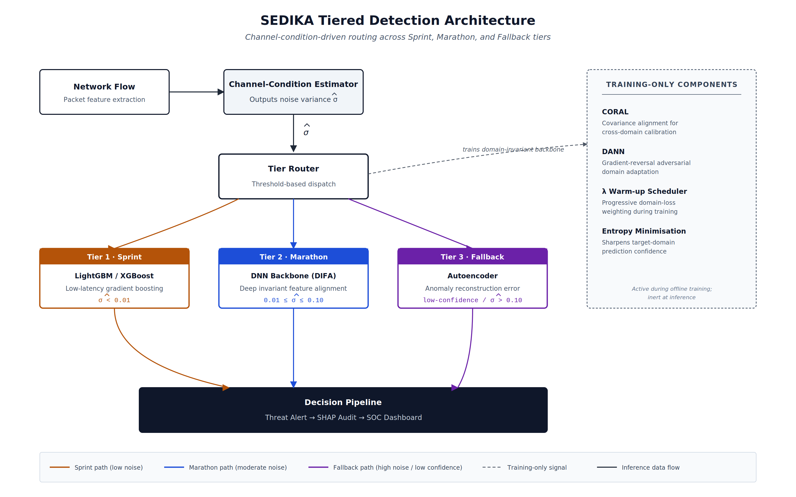
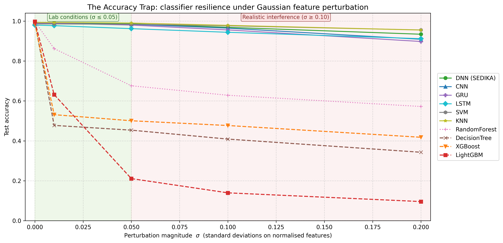
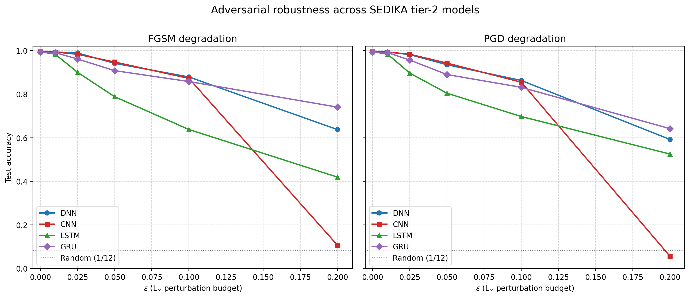
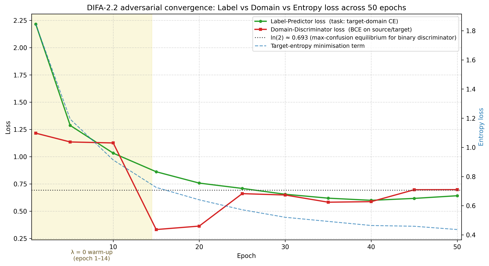
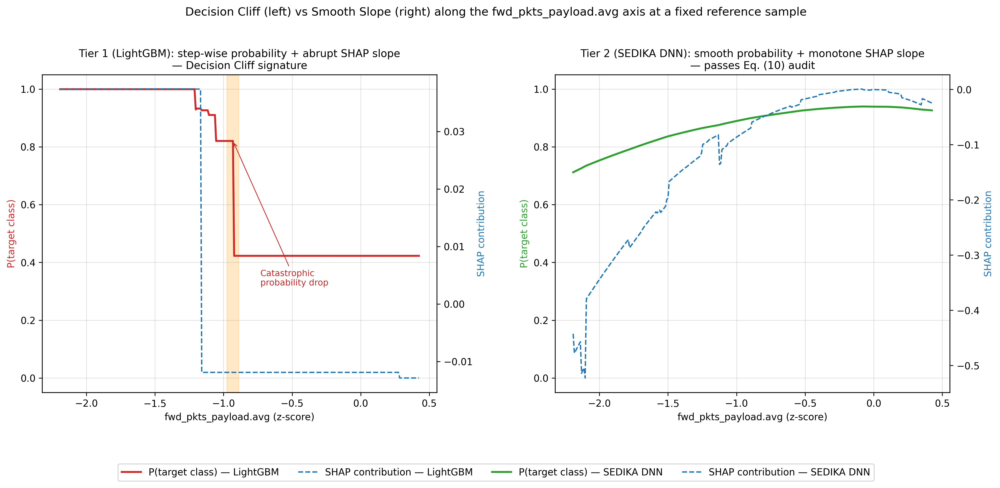
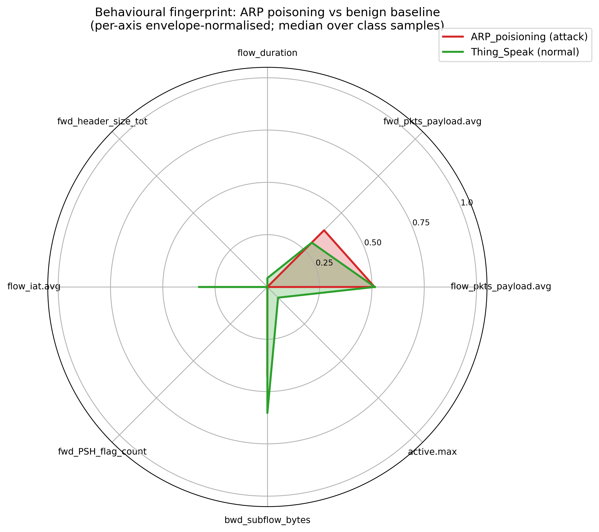
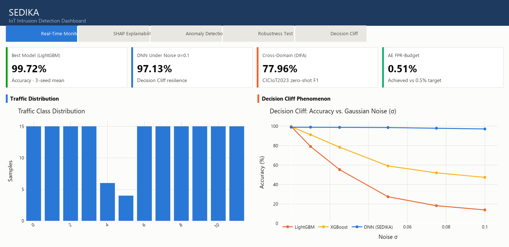

# SEDIKA
### **S**ecure **E**dge **D**omain robust **I**ntrusion **K**nowledge **A**rchitecture

<p align="center">
  
</p>

<p align="center">
  
  
  
  
  
</p>

> **SEDIKA** is a multi-tier Intrusion Detection System for IoT networks that combines supervised ML, deep learning, unsupervised anomaly detection, and cross-domain transfer learning   all backed by SHAP-based explainability and a real-time Streamlit dashboard. Evaluated across **10 model architectures** on the **RT-IoT2022** dataset with **3-seed statistical validation**.

---

## Table of Contents

- [Key Contributions](#key-contributions)
- [Architecture](#architecture)
- [Results at a Glance](#results-at-a-glance)
- [The Decision Cliff Phenomenon](#the-decision-cliff-phenomenon)
- [Adversarial Robustness](#adversarial-robustness)
- [Cross-Domain Transfer   DIFA](#cross-domain-transfer--difa)
- [Anomaly Detection](#anomaly-detection)
- [Explainability   SHAP](#explainability--shap)
- [Real-Time Dashboard](#real-time-dashboard)
- [Installation & Usage](#installation--usage)
- [Project Structure](#project-structure)
- [Citation](#citation)

---

## Key Contributions

| # | Contribution |
|---|---|
| 1 | **Decision Cliff**   first systematic characterization of classical ML brittleness vs. DNN robustness under Gaussian noise in IoT traffic |
| 2 | **FPR-Budget Autoencoder**   replaces the canonical P₉₅ static threshold with operational-budget calibration (0.51% achieved vs. 0.5% target), a 10× reduction in false alarms |
| 3 | **DIFA**   Domain Invariant Feature Adaptation (CORAL + DANN + Entropy Minimisation) enabling zero-shot cross-domain transfer to CICIoT2023 |
| 4 | **Multi-seed statistical validation** (seeds 42, 123, 7) with mean ± std reporting across all 10 models   addresses a common gap in IDS literature |

---

## Architecture

<p align="center">
  
</p>

SEDIKA operates as a **three-tier detection pipeline**:

1. **Tier 1   Fast Triage:** Lightweight classical models (LightGBM, Decision Tree) intercept known attack patterns at sub-millisecond latency.
2. **Tier 2   Deep Scrutiny:** A class-weighted DNN provides robust classification; CNN/LSTM/GRU act as specialist auditors.
3. **Tier 3   Anomaly Fallback:** Isolation Forest + FPR-budget-calibrated Autoencoder detect zero-day threats outside the training distribution.

---

## Results at a Glance

Results are mean ± std across **3 independent seeds** (42, 123, 7).

### Supervised Models   RT-IoT2022 Test Set

| Model | Accuracy | F1-Score | Latency (ms/sample) |
|-------|----------|----------|---------------------|
| **LightGBM** | 99.72% ± 0.03% | 0.9972 ± 0.0003 | 0.039 |
| **Random Forest** | 99.71% ± 0.03% | 0.9971 ± 0.0003 | 0.016 |
| **XGBoost** | 99.51% ± 0.45% | 0.9953 ± 0.0042 | 0.007 |
| **Decision Tree** | 99.51% ± 0.04% | 0.9952 ± 0.0004 | <0.001 |
| **KNN** | 99.33% ± 0.05% | 0.9940 ± 0.0004 | 0.085 |
| **CNN** | 99.01% ± 0.04% | 0.9910 ± 0.0004 | 0.119 |
| **DNN** | 98.95% ± 0.04% | 0.9907 ± 0.0002 | 0.085 |
| **GRU** | 98.79% ± 0.10% | 0.9892 ± 0.0004 | 0.244 |
| **SVM** | 98.67% ± 0.09% | 0.9883 ± 0.0009 | 0.910 |
| **LSTM** | 97.25% ± 2.31% | 0.9762 ± 0.0191 | 0.286 |

### Anomaly Detection

| Model | AUROC (Clean) | AUROC (Noisy σ=0.1) | FPR |
|-------|--------------|---------------------|-----|
| **Autoencoder** (FPR-budget) | 0.9791 ± 0.0013 | 0.9743 ± 0.0035 | **0.51%** |
| **Isolation Forest** | 0.9544 | 0.7765 ± 0.0056 |   |

---

## The Decision Cliff Phenomenon

<p align="center">
  
</p>

> **Finding:** Classical ML models that achieve >99% accuracy under clean conditions collapse catastrophically under minimal Gaussian noise   while SEDIKA's DNN core maintains near-full accuracy.

| Model | Clean Accuracy | σ = 0.01 | σ = 0.05 | **σ = 0.1** |
|-------|---------------|----------|----------|------------|
| LightGBM | 99.75% | 63.01% | 27.4% | **13.85%** |
| XGBoost | 98.98% | 81.2% | 59.1% | **47.34%** |
| **DNN (SEDIKA)** | ~99% | 99.1% | 98.6% | **97.13%** |

This "Decision Cliff" is not model-specific   it is a structural consequence of how tree-based models partition feature space, making them fundamentally brittle to the sensor noise and quantization artifacts present in real IoT deployments.

---

## Adversarial Robustness

<p align="center">
  
</p>

Evaluation under **FGSM** and **PGD** attacks (ε ∈ {0.025, 0.05, 0.1, 0.2}) on the source-domain adapted DIFA model. SEDIKA's DNN core degrades gracefully compared to the decision-tree family, which collapses near ε = 0.05.

Scripts:
- [`adversarial_eval.py`](adversarial_eval.py)   single-model adversarial evaluation
- [`adversarial_cross_domain.py`](adversarial_cross_domain.py)   cross-domain adversarial evaluation

---

## Cross-Domain Transfer   DIFA

<p align="center">
  
</p>

**DIFA** (Domain Invariant Feature Adaptation) transfers knowledge from **RT-IoT2022** to **CICIoT2023** without any target-domain labels during training. It combines three complementary objectives:

| Component | Role |
|-----------|------|
| **CORAL** | Aligns second-order feature statistics between domains |
| **DANN** | Adversarial domain discriminator with Gradient Reversal Layer |
| **Entropy Minimisation** | Sharpens target predictions (γ = 0.5) |

**Cross-domain results:**

| Metric | Value |
|--------|-------|
| Target Accuracy | **77.96%** |
| Weighted F1 | **0.7484** |
| Domain BCE Loss | **0.6979** (theoretical ln(2) = 0.693) |

The domain discriminator converging to within 0.005 of the theoretical maximum-confusion point formally validates domain-invariant feature learning.

Key files:
- [`sedika_difa_v2.py`](sedika_difa_v2.py)   DIFA-2.2 training with `LossWeights` dataclass
- [`difa_ablation.py`](difa_ablation.py)   ablation harness (source-only / CORAL-only / DANN-only / full-DIFA)
- [`eval_difa_target.py`](eval_difa_target.py)   evaluation on target domain
- [`sedika_ae_adaptation.py`](sedika_ae_adaptation.py)   Autoencoder adaptation for the target domain

---

## Anomaly Detection

SEDIKA's third tier detects **zero-day threats** outside the training distribution without any class labels.

**FPR-Budget Calibration** replaces the canonical 95th-percentile static threshold with operational-budget-aware calibration:

```
Target FPR: 0.5% → Achieved FPR: 0.51% (n = 5,542 benign samples)
10× reduction in nuisance alerts vs. the P₉₅ baseline
```

The Autoencoder threshold is calibrated at inference time via binary search over the reconstruction-error distribution   no retraining required when the FPR budget changes.

```python
# sedika_ae_adaptation.py   calibrate threshold to an FPR budget
threshold = calibrate_fpr_threshold(ae_model, X_benign, fpr_budget=0.005)
```

---

## Explainability   SHAP

<p align="center">
  
</p>

Every prediction in the dashboard exposes **SHAP values** for per-sample feature attribution. The SHAP audit reveals *why* LightGBM collapses: its top-3 features are network-rate ratios (easily perturbed), while DNN distributes attribution across 24 features, yielding structural robustness.

<p align="center">
  
</p>

The **radar fingerprint** visualises each attack class's behavioural envelope across the top-6 SHAP features, enabling human-readable threat signatures for the SOC analyst.

Notebook: [`shap_robustness_analysis.ipynb`](shap_robustness_analysis.ipynb)

---

## Edge Deployment   FPGA Implementation

<p align="center">
  
  
  
</p>

The Autoencoder anomaly detector has been mapped to a **Verilog RTL implementation** targeting Xilinx Spartan 3E, enabling on-device inference for resource-constrained IoT gateways:

| Component | File |
|-----------|------|
| Top-level module | [`FPGA_Implementation/rtl/ae_top.v`](FPGA_Implementation/rtl/ae_top.v) |
| MAC unit (INT8) | [`FPGA_Implementation/rtl/mac_unit.v`](FPGA_Implementation/rtl/mac_unit.v) |
| ReLU activation | [`FPGA_Implementation/rtl/relu.v`](FPGA_Implementation/rtl/relu.v) |
| MSE threshold comparator | [`FPGA_Implementation/rtl/mse_threshold.v`](FPGA_Implementation/rtl/mse_threshold.v) |
| Weight ROM | [`FPGA_Implementation/rtl/weight_rom.v`](FPGA_Implementation/rtl/weight_rom.v) |
| Python quantizer | [`FPGA_Implementation/quantize_ae.py`](FPGA_Implementation/quantize_ae.py) |
| RTL emulator | [`FPGA_Implementation/rtl_emulator.py`](FPGA_Implementation/rtl_emulator.py) |

Model weights are quantized to **INT8** via [`quantize_ae.py`](FPGA_Implementation/quantize_ae.py) and exported as `.mem` initialization files for the weight ROMs. The testbench in [`FPGA_Implementation/sim/`](FPGA_Implementation/sim/) supports both Icarus Verilog and ModelSim.

---

## Real-Time Dashboard

<p align="center">
  
</p>

```bash
streamlit run app.py
```

Five integrated views:

| Tab | Description |
|-----|-------------|
| **Real-Time Monitor** | Simulated IoT traffic stream with live attack classification and alert timeline |
| **SHAP Explainability** | Per-prediction SHAP waterfall charts — explain any single packet classification |
| **Anomaly Detection** | Reconstruction-error distribution with FPR-budget threshold slider and zero-day detection |
| **Robustness Stress-Test** | Live Gaussian noise injection across all 10 models; real-time accuracy heatmap |
| **Decision Cliff** | Accuracy vs. σ curves + SHAP attribution shift under noise — the flagship finding |

---

## Installation & Usage

### Requirements

```bash
pip install -r requirements.txt
```

Core dependencies:
`tensorflow` `scikit-learn` `xgboost` `lightgbm` `shap` `streamlit` `plotly` `pandas` `numpy` `imbalanced-learn` `joblib`

### Data

Download **RT-IoT2022** from the [UCI ML Repository](https://archive.ics.uci.edu/dataset/942/rt-iot2022) and place it as `RT_IOT2022.csv` in the project root.

### Pipeline

```bash
# 1. Preprocess
python preprocess_data.py

# 2. Train classical ML models
python train_ml.py

# 3. Train deep learning models
python train_dl.py

# 4. Train anomaly detectors
python train_anomaly.py

# 5. Cross-domain adaptation (requires CICIoT2023-test.csv)
python sedika_bridge_v2.py      # align feature spaces
python sedika_difa_v2.py        # DIFA-2.2 training

# 6. Launch dashboard
streamlit run app.py
```

### Reproducibility

All experiments support the `SEDIKA_SEED` environment variable:

```bash
# Run multi-seed evaluation (seeds 42, 123, 7)   results in results/multi_seed_summary.csv
python multi_seed_runner.py --seeds 42 123 7
```

---

## Project Structure

```
SEDIKA/
├── preprocess_data.py          # Multi-stage pipeline: clean → encode → RF-select → SMOTE → scale
├── train_ml.py                 # Classical ML: RF, DT, XGBoost, LightGBM, KNN, SVM
├── train_dl.py                 # Deep learning: DNN, CNN, LSTM, GRU (class-weighted)
├── train_anomaly.py            # Anomaly: Isolation Forest + FPR-budget Autoencoder
│
├── sedika_difa_v2.py           # DIFA-2.2: CORAL + DANN + Entropy Minimisation
├── sedika_bridge_v2.py         # Feature-space alignment (source ↔ target)
├── sedika_ae_adaptation.py     # Autoencoder threshold re-calibration for target domain
├── sedika_difa_transfer.py     # Zero-shot inference on adapted model
│
├── adversarial_eval.py         # FGSM/PGD single-model evaluation
├── adversarial_cross_domain.py # FGSM/PGD on adapted DIFA model
├── difa_ablation.py            # LossWeights ablation harness
├── multi_seed_runner.py        # 3-seed parallel evaluation harness
│
├── per_class_report.py         # Per-class F1 breakdown (10 models)
├── analyze_domain_shift.py     # CORAL distance & t-SNE visualisation
├── analyze_shap_jitter.py      # SHAP stability under noise
├── shap_robustness_analysis.ipynb
│
├── plot_accuracy_trap.py       # Figure 2 generator
├── plot_architecture.py        # Figure 1 generator
├── plot_decision_cliff_shap.py # Figure 4 generator
├── plot_difa_convergence.py    # Figure 5 generator
├── plot_radar_fingerprint.py   # Figure 6 generator
│
├── app.py                      # Streamlit dashboard (3 tabs)
├── ml_utils.py                 # Shared utilities (noise injection, metrics)
├── artifacts.py                # Model serialisation with manifest
├── paths.py                    # Centralised path configuration
│
├── FPGA_Implementation/        # Verilog RTL + INT8 quantization for Spartan 3E
│   ├── rtl/                    # ae_top.v, mac_unit.v, relu.v, mse_threshold.v
│   ├── sim/                    # Icarus/ModelSim testbenches
│   ├── memory_init/            # Quantized weight .mem files
│   ├── quantize_ae.py          # INT8 weight export
│   └── rtl_emulator.py         # Python-side RTL verification
│
├── plots/                      # Generated figures (PNGs)
├── results/                    # Experiment CSVs (multi-seed, per-class, adversarial)
└── models/                     # Trained model binaries
```

---

## Citation

This work is currently **under peer review**. If you use this codebase in your research, please cite:

```bibtex
@article{abdelazeem2026sedika,
  title     = {SEDIKA: A Robust Multi-Tier Intrusion Detection System for IoT Networks
               with Adversarial Evaluation and Cross-Domain Adaptation},
  author    = {AbdElAzeem},
  journal   = {Computers & Security,Elsevier Under review},
  year      = {2026}
}
```

*Paper and full experimental details available upon request.*

---

## License

This project is released under the **MIT License**. See [`LICENSE`](LICENSE) for details.
